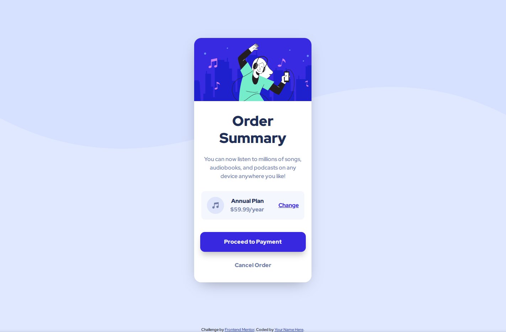
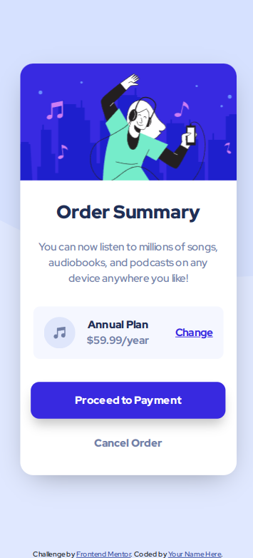

### Links

- Live Site URL: [Netlify](order-summary-component-main-zzah.netlify.app)

## My process

### Screenshots

### Built with

- Semantic HTML5 markup
- CSS custom properties
- Mobile-first workflow
- [Bootstrap](https://getbootstrap.com/docs/5.0/getting-started/introduction/) - CSS library

### Continued development

In the future, I plan adding JavaScript events.

## Author

- Frontend Mentor - [@zuzanka-cyranka](https://www.frontendmentor.io/profile/zuzanka-cyranka)
